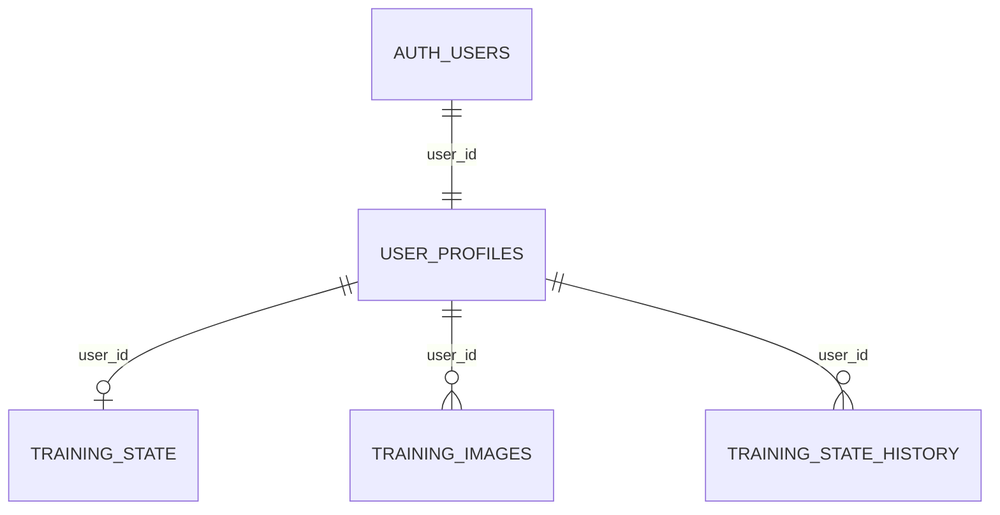

# Account data, profile and theme update

The earlier course data was reset by the user. This update does not recreate completed days or restore old answers automatically.

## Changes

- My profile is a dedicated navigation section. Profile editing is removed from Mission control and Settings; the form closes after submission and the cloud save status stays visible.
- The profile includes username, full name, experience, target role, companies, daily study budget, focus areas and communication goal, plus real course activity.
- Signed-in changes are checkpointed to IndexedDB immediately, keyed by Supabase project and Auth user UUID. Supabase remains the authoritative shared store. The last 12 periodic local checkpoints are retained.
- Unsynced, conflicting or older copies are shown for explicit recovery. A missing cloud row never triggers automatic recovery of an old course, and a reset is not undone by a local checkpoint.
- Cloud-load failures pause editing rather than presenting an editable empty course. Reloading a missing row leaves displayed work intact. Failed saves and pending changes are visible on every page.
- Backup imports and explicit recovery merges retain existing answer history. Other accounts' local checkpoints are not read.
- Dark mode now has shared background, surface, border and text colors for nested dashboard cards, pending days, forms, code, dialogs, timeline, profile and OOP sections. Theme preference survives reload.

## Database setup required

For an existing installation, run `public/account-safety-migration.sql` in the Supabase SQL Editor. For a new installation, run `public/supabase-setup.sql`, which includes the same migration at the end.

The migration is transactional and preserves current progress:

Supabase Auth owns passwords and account email. `user_profiles.user_id` is the same UUID as `auth.users.id`. New accounts receive a profile automatically. Course progress and screenshots gain foreign keys to that profile.

The authenticated save RPC locks the user's profile row, checks the expected course revision and start-date lock, then writes both profile details and progress in one transaction. Clients lose direct insert/update/delete access to `training_state`; they must use the RPC. RLS limits profile, screenshot, course and revision-history reads to the signed-in owner.

`training_state_history` retains cloud revision snapshots. This starts when the migration is applied; it cannot reconstruct records deleted before installation. History is append-only for normal clients and may need an owner-defined retention policy as usage grows.

The migration was prepared locally. It must not be described as applied to the live project without confirmation from Supabase.
